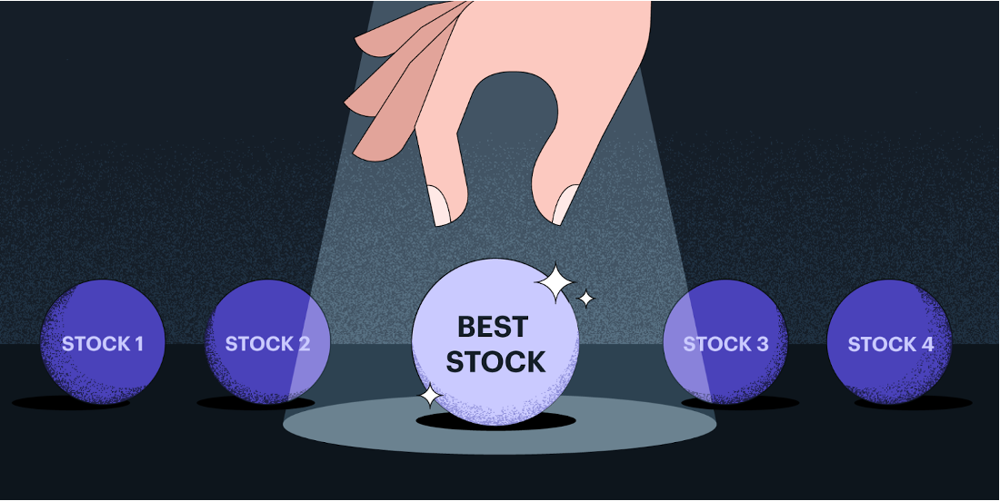
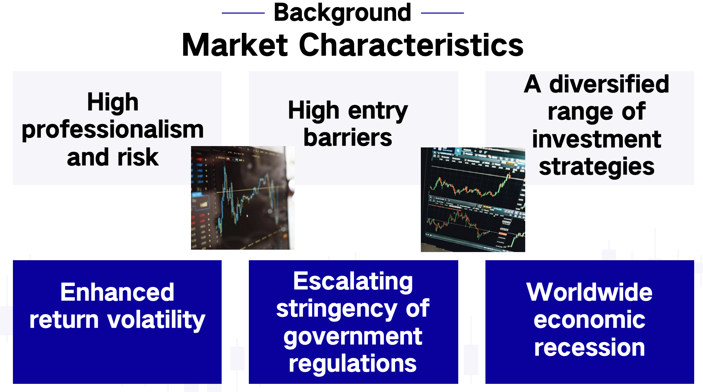

# KRS:K-nearest neighbour base stock Recommendation system

## Project Overview

This project aims to develop a big data-based stock market prediction and recommendation system tailored for private equity firms to enhance investment decision accuracy and effectiveness.

### Objectives
- Provide short-term investment strategy services.
- Improve investor trust and increase fundraising competitiveness.

### Methods
1. **Prediction Model**:
   - Utilize Long Short-Term Memory (LSTM) networks to forecast stock prices for the next 30 days.
   - Use Mean Squared Error (MSE) as the evaluation metric.

2. **Recommendation Model**:
   - Conduct data mining on predicted returns, stock prices, and stability.
   - Employ K-means clustering and K-Nearest Neighbors (KNN) to develop an unsupervised learning system identifying stocks with similar attributes.

### Features
- Data visualization and reporting tools to enhance investor comprehension and satisfaction.
- Continuous model improvement and user feedback integration for system reliability and effectiveness.

This project provides clients with personalized recommendations to support diversified investment strategies.
